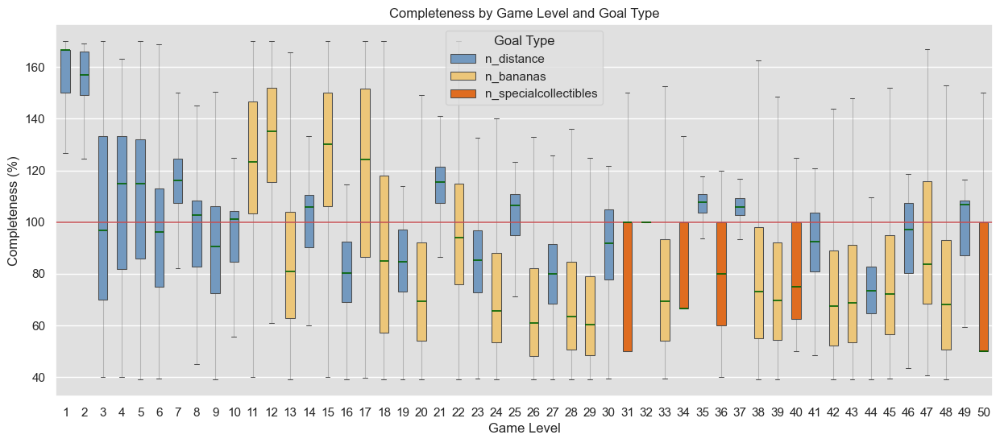

# Jungle Vine Runner: Level Balancing & Player Retention Analysis

**Project Goal:** Identify friction points in the difficulty curve of a mobile platformer to optimize player engagement and prevent churn.

---

## Executive Summary
This project analyzes player telemetry data from the first 50 levels o of a live mobile title. By evaluating level completeness across different goal types, I identified key **difficulty spikes** and **boredom traps** that negatively impact the First Time User Experience (FTUE) and identify specific level configurations causing **player friction** and potential **churn**. 

**Key Outcome:** Recommended specific rebalancing for 10+ levels to align the game with a "Flow State" difficulty curve.

---
## About the Data Source
**Project Codename:** *Jungle Vine Runner*

The data used in this analysis is derived from a live mobile platformer. To maintain data privacy and adhere to confidentiality standards, the specific game title and user identifiers have been anonymized. The game features momentum-based progression across 50+ levels with varying goal types (Collection, Distance, and Time-based).

---

## Key Insights & Results

To identify problematic levels, We visualized the **Completeness Percentage** (Actual Progress / Target Goal). We define an engaging level as one where the median completeness (green line) sits near the 100% threshold (red line), indicating it is "challenging but achievable."
Levels where the IQR falls entirely below the red line are candidates for difficulty reduction.

### 1. The Level 20 "Wall"
Levels involving **banana collection** show a drastic drop in completeness after Level 20. This indicates a sudden difficulty spike that may lead to player frustration and early churn.
* **Risk**: This creates a "wall" that likely triggers high churn rates for players finishing their first session.
### 2. FTUE Imbalance (Level 15)
Levels 11,12 and 15 are statistically outliers for the early game. The median completeness sits significantly above 100%, and the IQR entirely avobe the 100% line suggests almost no challenge across all skill levels. 
* **Risk:** High-skill players may perceive the game as "too easy" and lose interest during the critical retention window.

### 3. Mechanic-Specific Friction
Levels centered on **"Special Collectibles"** are consistently under-performing in success rates compared to "Distance" or "Banana" goals. This suggests the spawn rate or placement of these items is currently tuned too high for the average player.

---

## Recommendations

| Level(s) | Issue | Proposed Action |
| :--- | :--- | :--- |
| **11, 12, 15** | Low Challenge | Increase `goal_value` by 20% to maintain engagement. |
| **20-30** | Difficulty Spike | Increase `limit_value` (swings/time) to soften the learning curve. |
| **Collectibles** | High Friction | Increase item density or implement "pity spawns" to boost completeness. |

---

## Methodology & Tech Stack

* **Data Cleaning:** Handled raw logs to remove corrupted sessions and anonymized user IDs.
* **Feature Engineering:** Calculated "Completeness Percentage" by normalizing `actual_value` against `target_goal`.
* **Analysis:** Utilized Boxplot distributions to identify variance in player skill vs. level difficulty.

**Tools Used:**
* **Python (Pandas/NumPy):** Data manipulation and cleaning.
* **Seaborn/Matplotlib:** Statistical visualization.
* **Jupyter Notebooks:** Documentation of the EDA process.

---

## Data Dictionary
The analysis was performed on two primary datasets:
1.  **levels.csv**: Configuration data (goals, limits, and target scores).
2.  **logs.csv**: Player-level telemetry (1-day snapshot) including `device_id`, `end_reason`, and `pathtrace` coordinates.

---

## Environment & Data Access
The raw telemetry data used in this analysis is excluded from this repository for performance and privacy reasons.

**To review the logic and methodology:**
* **[01_data_cleaning_and_validation.ipynb](01_data_cleaning_and_validation.ipynb):** ETL pipeline, data type optimization, and coordinate string handling.
* **[02_exploratory_data_analysis.ipynb](02_exploratory_data_analysis.ipynb):** Statistical analysis and visualization suite.
* **Requirements:** See `requirements.txt` for the specific versions of Pandas and Scipy used to ensure reproducibility.