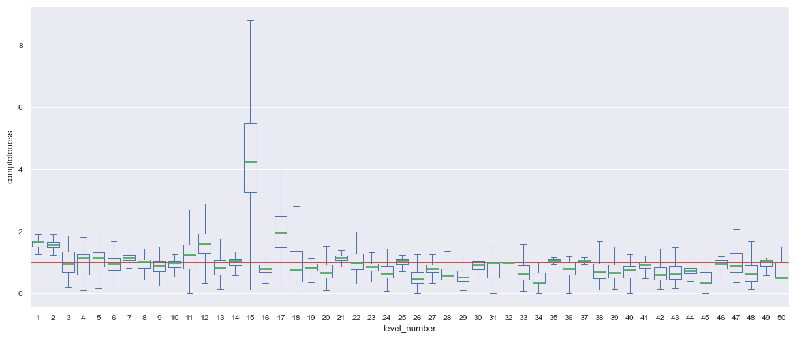

# mobile-game-data-analysis
Game progression analysis of a mobile game
## Introduction
In this project I am performing an Exploratory data analysis from a mobile game.

### About the game
"Jungle Vine Runner" is a fictional game where players control a character that swings on vines and collects bananas and other special collectibles. The game is divided in consecutive levels, and each one has its own Goal and restrictions. This project only will analyse the first 50 levels.

### About the data
#### Source data
- The data used for this project are the game logs for one day.
- The data has been annonymised.
#### meatadata
The "levels.csv" file contains each level's configuration, like the goal and restrictions that applay for the specific level. This file is the point of comparison to estimate how well the players has played an specific attempt. Here is the structure of this data:

|Column |Description    |
|-----|----|
|lvl|Level number|
|goal_type|There three types of goal: Collect bananas,reach a distance, or collect special collectibles|
|goal_value|The goal value to meet|
|limit_type|There are two types of restriction: Time restriction, Swings restriction|
|limit_value|The restricition value to meet|
|target_goal|Collecting objects will increase the scoring. Players must meet the specific scoreing in order to win the level.|

The "logs.csv" file stores logs about each attempt to complete a level.
The log data contains information that is not of interest for this project, and is cleaned or discarded during the EDA process. The prepared and cleaned data is stored in the "logs.csv" and is structured as follow:

|Column |Description    |
|-----|----|
|device_id||
|date_time||
|level_number||
|end_reason||
|lives_left||
|n_bananas||
|n_distance||
|n_specialcollectibles||
|n_swings||
|pathtrace||
|stars||
|swings_left||
|time_used||
|total_duration||
|score||
## Results

